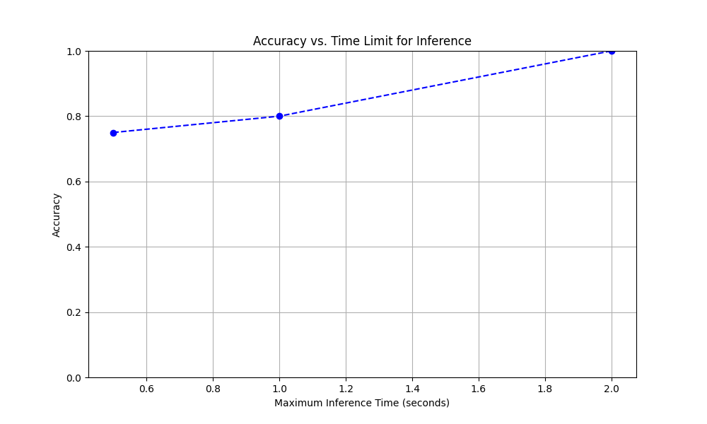

# hypobras

Description:
This project explores how Cerebras’ fast inference capabilities can be used to simulate cognitive science experiments where decision-making is constrained by time. We designed an experiment that tests model performance under different time limits, with tasks such as solving mental math problems. The goal is to mimic human-like scenarios where thinking time is restricted and measure the trade-offs between speed and accuracy.

POC Results:

